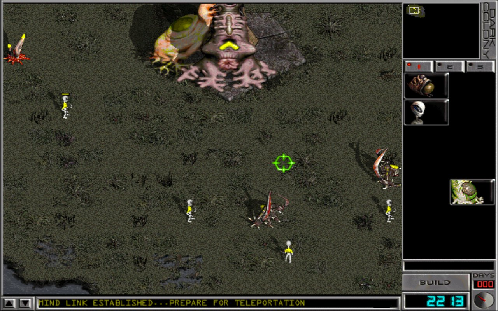

# Dark Colony Web

**[Play Now](https://newmassrael.github.io/dark-colony-web/)**

Play [Dark Colony](https://en.wikipedia.org/wiki/Dark_Colony) (1997) in your browser. A WebAssembly port of the reverse-engineered game.



## How to Play

You need the original Dark Colony game files. Two ways to load them:

### CD Images (recommended)
Click **Select CD Image Folder** and pick a folder containing disc images. Supported formats:
- **CUE + BIN** (recommended) — supports background music
- **MDF** — game data only, no background music
- **ISO** — game data only, no background music

Both base game and expansion pack disc images are supported. If both are in the same folder, they are detected automatically.

### Game Folder
Click **Select Game Folder** and pick the folder containing your installed game files (ANIM.DAT, FADE.DAT, etc.).

### Background Music
CD audio playback requires **CUE + BIN** format. If your disc image is in another format, you can convert it using tools like [bchunk](https://github.com/hessu/bchunk) or place pre-extracted WAV files in a `music/` folder (`track02.wav`, `track03.wav`, ...).

## Features

- Full single-player campaign (base game + expansion pack)
- Multiplayer via WebSocket relay server
- Save game persistence (survives page reloads)
- Fullscreen support (F11)
- Gamepad / keyboard / mouse input

## Browser Support

Requires the [File System Access API](https://developer.mozilla.org/en-US/docs/Web/API/File_System_Access_API):
- **Opera** (desktop) — recommended. Disable mouse gestures to prevent right-click from navigating away: paste `opera://settings/?search=Enable+mouse+gestures` into the address bar.
- **Chrome / Edge** — works, but fullscreen (F11) exit bar at the top edge blocks upward map scrolling
- Firefox / Safari — not supported

## Self-Hosting

Serve the files with any static HTTP server:

```bash
python -m http.server 8080
```

### Multiplayer Relay Server

```bash
cd server
pip install websockets
python relay_server.py
```

Or with Docker:

```bash
cd server
docker compose -f docker-compose.relay.yml up -d
```

## Legal

This project does not include any copyrighted game assets. You must provide your own copy of Dark Colony to play.

## License

MIT
